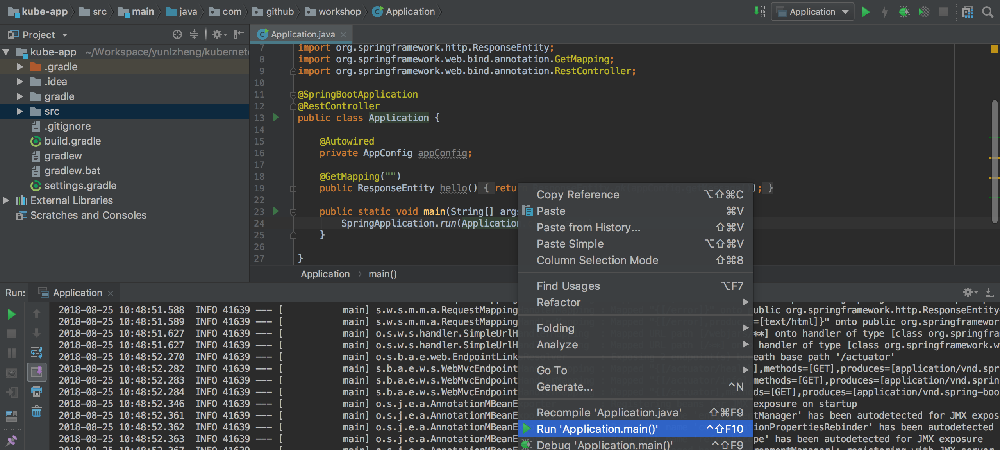

# Day 1 - Kubernetes Core Concept

今天将从一个Spring Cloud的项目实例开始，了解Kubernetes相关的核心概念。

## 1. 准备工作

* IDEA: Java集成开发环境，[下载安装地址](https://www.jetbrains.com/idea/download/#section=mac)；
* Kubectl: Kubernetes命令行工具；
* Docker: Mac用户安装[Docker for mac](https://store.docker.com/editions/community/docker-ce-desktop-mac)即可；
* 阿里云账号，并开通[阿里云容器服务](https://cr.console.aliyun.com/);

### 1.1 安装Kubectl命令行工具：

```
brew install kubernetes-cli
```

获取Kubernetes集群配置文件[config](config),并保存到本地文件`~/.kube/config`

检查是否能够正常访问集群

```
$ kubectl
kubectl cluster-info
Kubernetes master is running at https://x.x.x.x:6443
Heapster is running at https://x.x.x.x:6443/api/v1/namespaces/kube-system/services/heapster/proxy
KubeDNS is running at https://x.x.x.x:6443/api/v1/namespaces/kube-system/services/kube-dns:dns/proxy
monitoring-influxdb is running at https://x.x.x.x:6443/api/v1/namespaces/kube-system/services/monitoring-influxdb/proxy

To further debug and diagnose cluster problems, use 'kubectl cluster-info dump'.
```

### 1.2 下载初始化项目代码，并导入IDEA环境

从[http://7pn5d3.com1.z0.glb.clouddn.com/kube-app-v0.0.1.zip](http://7pn5d3.com1.z0.glb.clouddn.com/kube-app-v0.0.1.zip)下载实例项目

解压到工作目录`$WORKSPACE/kube-app`

确保项目能够正常编译

```
cd $WORKSPACE/kube-app
./gradlew clean build
```

将kube-app项目导入到IDEA，进入Application.java运行main函数：



启动成功后，访问7001端口，确保程序以正常运行:

```
$ curl http://localhost:7001
This is the message from config file
```

## 1.3 准备容器仓库

在阿里云镜像仓库服务中，创建仓库命名空间，建议以自己的名字命名：


并开启自动创建仓库功能。

```
export NAMESPACE=k8s-mirrors
export DOCKER_REPO=registry.cn-hangzhou.aliyuncs.com/$NAMESPACE/kube-app
```

## 2 应用容器化

为了能够让应用程序能够运行在Kubernetes中，我们需要对应用进行容器化。在项目根路径上创建Dockerfile文件：

```
cd $WORKSPACE/kube-app
```

Dockerfile文件内容如下：

```
FROM gradle:4.9.0-jdk8 AS builder

ADD src ./src
ADD build.gradle ./build.gradle
ADD settings.gradle ./settings.gradle
RUN gradle build

FROM java:8
COPY --from=builder /home/gradle/build/libs/kube-app.jar kube-app.jar

ADD entrypoint.sh entrypoint.sh
RUN chmod +x entrypoint.sh
ENTRYPOINT ["./entrypoint.sh"]
```

这里采用Mutil-Stage形式定义Dockerfile文件，这样可以直接在容器中定义项目构建，以及镜像构建过程。

* 阶段一：在gradle镜像中完成项目的编译
* 阶段二：从gradle镜像中拷贝jar包，到java:8镜像中，并且使用自定义的entrypoint.sh作为启动脚本

在项目根目录下创建`entrypoint.sh`，内容如下：

```
#!/usr/bin/env bash
java -Xmx512m -Djava.security.egd=file:/dev/./urandom -jar kube-app.jar $@
```

在entrypoint.sh中，我们使用了$@，这样在运行容器时，可以添加任意的命令行参数。

使用Docker命令行工具，打包镜像

```
docker build --no-cache -t $DOCKER_REPO .
```

验证，镜像是否能够正常运行:

```
docker run -it -p 7001:7001 $DOCKER_REPO
```

## 3. 认识Pod和Controller

在项目根路径下，创建目录deply/manifests

```
cd $WORKSPACE/kube-app
mkdir deploy
cd deploy
mkdir manifests
```

### 3.1 单容器的Pod

创建文件kube-app-pod.yaml,内容如下：
> 注意：请修改$DOCKER_REPO到相应的镜像

```
apiVersion: v1
kind: Pod
metadata:
  labels:
    run: kube-app
  name: kube-app-pod
spec:
  containers:
  - image: $DOCKER_REPO # 请更改为相应的镜像
    name: kube-app
```

使用kubectl创建Pod实例

```
kubectl create -f kube-app-pod.yaml
```

查询所有Pod实例

```
kubectl get pods
NAME                                                        READY     STATUS            RESTARTS   AGE
kube-app-pod                                                0/1       PodInitializing   0          5s
```

### 3.2 多容器Pod

假设kube-app项目依赖了名为echo-server的服务，使用容器在本地运行服务依赖。

```
docker run -it -p 8080:8080 jmalloc/echo-server
```

## 4. 基于Service和Endpoint的服务发现

## 5. 使用ConfigMap和Secret管理配置

## 6. 使用RBAC管理应用权限

## 7. 使用Ingress开放应用访问地址

## 总结
